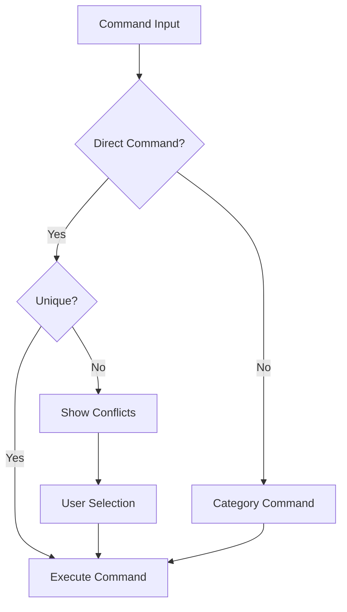

# System Patterns

## Command Resolution Flow

## Command Categories
Each category is a module that:
- Defines its commands
- Handles command execution
- Provides help documentation
- Manages category-specific configuration

## Command Registration
Commands are registered with:
- Command name
- Category
- Description
- Usage examples
- Default category (if applicable)

## Configuration Management
- YAML-based configuration
- Environment variable support
- User customization options
- Default settings

## Error Handling
- Command validation
- Category validation
- Argument validation
- User-friendly error messages
- Suggestion system for typos

## Extension Pattern
New categories can be added by:
1. Creating category module
2. Defining commands
3. Implementing execution logic
4. Adding configuration
5. Updating documentation
