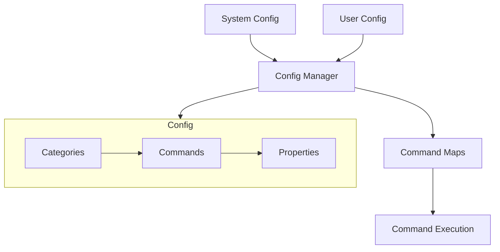
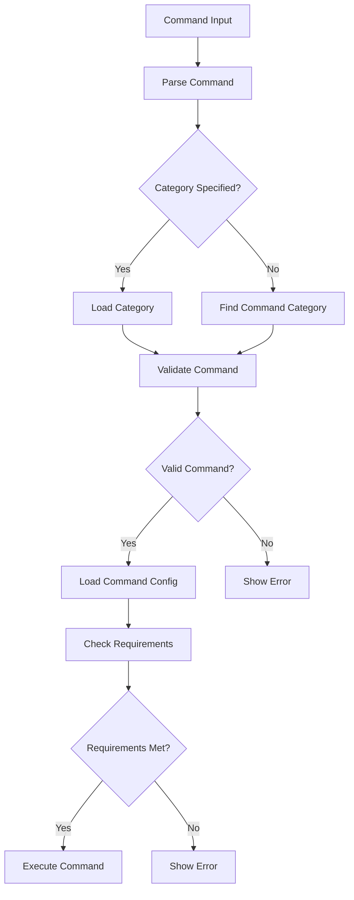
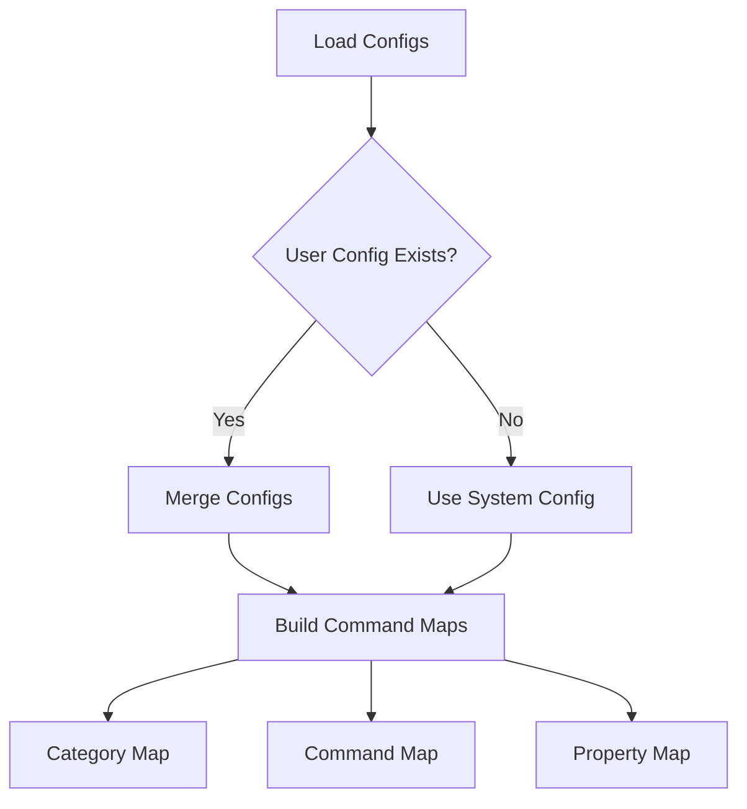

# System Patterns

## Configuration-Driven Architecture


## Command Resolution Flow


## Configuration Management


## Command Properties
Each command in the configuration defines:
- Description and usage
- Implementation details
- Execution requirements
- Error handling
- Working directory

## Command Categories
Categories are defined in config.yml with:
- Category name and description
- Command definitions
- Category-specific settings
- Help documentation

## Configuration Structure
```yaml
categories:
  category_name:
    name: "Display Name"
    description: "Category Description"
    commands:
      command_name:
        description: "Command Description"
        usage: "Usage Example"
        implementation: "Command to Execute"
        # Optional properties
        requires_git: boolean
        requires_sudo: boolean
        requires_confirmation: boolean
        args_required: boolean
        error_message: "Custom Error"
        working_dir: "Directory Path"
```

## Error Handling
- Configuration validation
- Command validation
- Requirement checking
- User-friendly error messages
- Custom error messages per command

## Extension Pattern
New functionality can be added by:
1. Editing user config (~/.config/me-tool/config.yml)
2. Adding new category or commands
3. Defining command properties
4. Changes take effect immediately

## Help System
Help documentation is generated from:
- Category descriptions
- Command descriptions
- Usage examples
- All sourced from configuration

## Working Directory Management
Commands can specify working directory:
- Absolute paths
- Special values (e.g., "project_root")
- Directory is restored after execution
